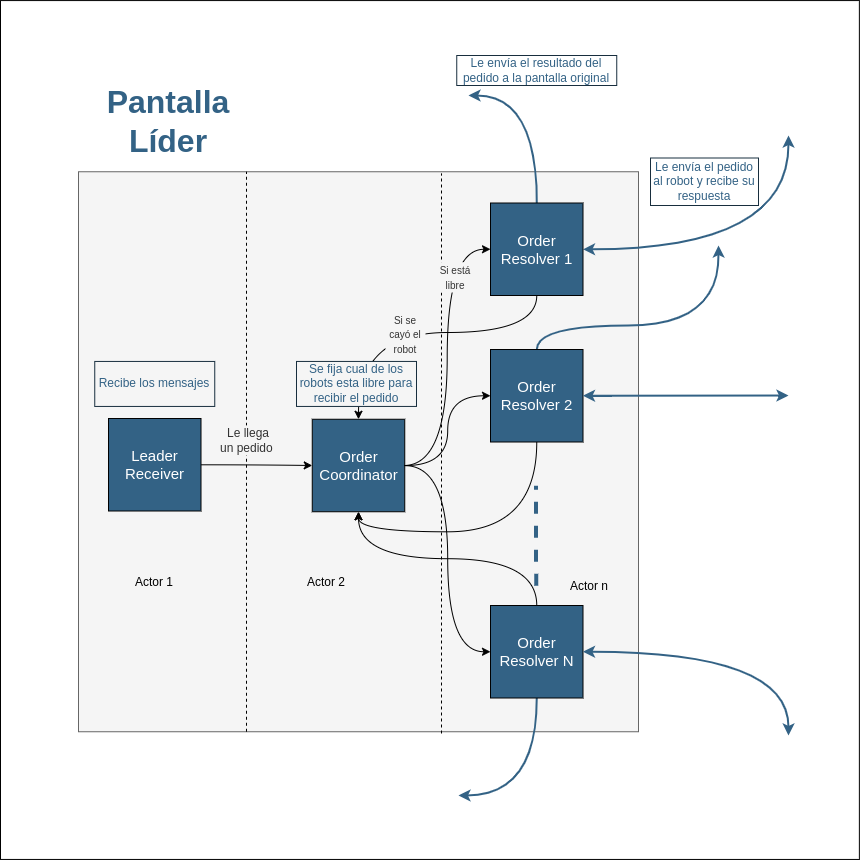
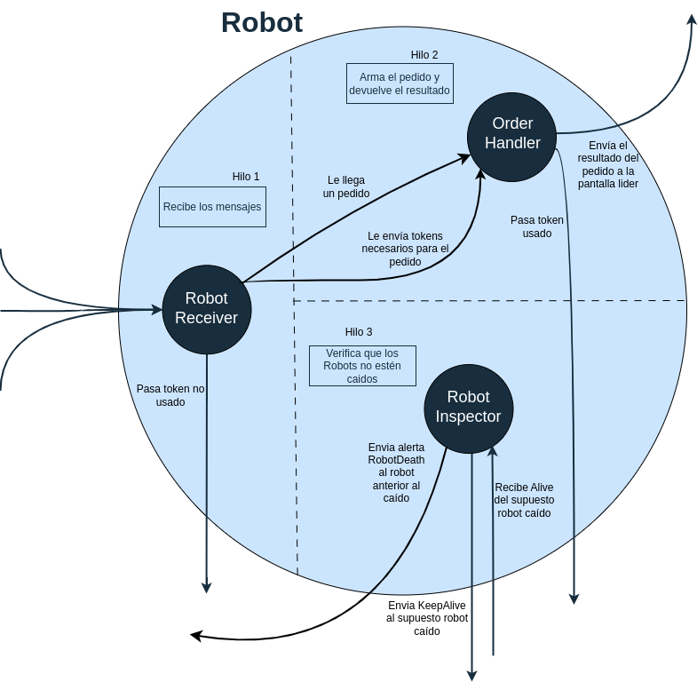
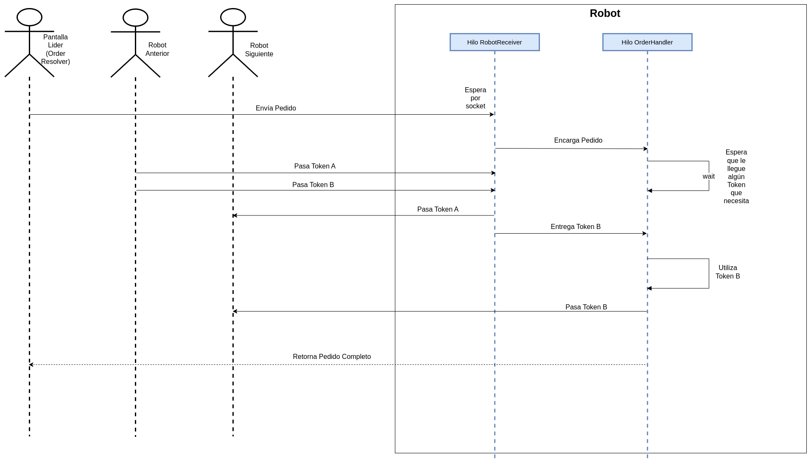

[](./diagramas/https://classroom.github.com/a/PKo6zpFB)

# Técnicas de Programación Concurrente I -Trabajo Práctico 2 “Heladería Robotizada”

## Integrantes

Pedro Gallino 107587

Manuel Pol 108448

Luca Lazcano 107044

Video presentación: https://drive.google.com/drive/folders/1IZVDaartmm17gpJXZsecthlyStg7yJH_?usp=sharing

# Arquitectura

## General

El sistema se compone de varias *Screens*, que son las encargadas de leer los archivos de los pedidos (uno por cada pantalla) y derivarlos a los robots. Las *screens* se organizan en un régimen centralizado donde una de ellas es convocada como la *ScreenLeader*. Esta se elige utilizando el algoritmo *Bully* de elección de líder, la del id más alto es la elegida. La líder se encarga de recibir todos los pedidos del resto de las pantallas y coordinarlos para entregarlos a los robots que están **libres** (en funcionamiento y sin estar resolviendo un pedido), teniendo variables de estado que precisamente le indican la condición de los robots. De esta forma nos evitamos un grande e innecesario tránsito de mensajes entre pantallas y robots para encontrar los robots disponibles a recibir un pedido.

Los *Robots* son los actores que concretamente resuelven los pedidos. Los reciben por medio de la pantalla líder y son los encargados de manejar los contenedores de helados para completarlos. Los contenedores de helados están representados por *tokens* (uno por cada gusto), que se van transportando por los robots en círculos, haciendo uso del algoritmo de *Token Ring*. Un robot puede acceder al contenedor de un gusto en específico de helado solamente cuando obtiene el *token* del mismo, *token* que mantiene el estado actualizado del contenedor.

Por último tenemos al *Gateway* de pagos. Este tiene como función (decidir si) capturar la tarjeta vinculada a un pedido y, una vez que el pedido fue confirmado , anotarlo en un *log*. En caso de que la tarjeta sea rechazada o no se pudo resolver el pedido, se *loguea* lo ocurrido en el archivo. El *gateway* es una entidad única y se da por hecho que nunca falla.

# Entidades principales del Modelo

## Screens:

- Varias instancias de *screens* actúan como puntos de entrada para los pedidos de los clientes.
- Cada pantalla se encarga de leer de su correspondiente archivo.
- Las pantallas envían pedidos al líder y esperan su respuesta.
- Una de las pantallas actúa como el líder y es ésta la que se comunica con los robots.
- En caso de que una detecte la caída del líder, ejecutan el algoritmo *Bully* de elección de líder.
- Cada pantalla realiza un commit de dos fases, solicitandole primero al *gateway* y luego a la pantalla líder (para que reenvíe el pedido a algún robot).
- Las pantallas y el líder se comunican por red UDP. Lo mismo ocurre con las pantallas y el *gateway.*

## ScreenLeader:

- El líder es una pantalla que gestiona la distribución de pedidos a los robots.
- Distribuye los pedidos a los robots a través de la red (UDP).
- Esta *screen* recibe los resultados de los pedidos y se los reenvía a las correspondientes pantallas (con un *ready* o *abort*, para el commit de dos fases).
- Su funcionamiento se implementa mediante Modelo de Actores.

## Robots:

- Los robots se encargan de preparar los pedidos.
- Utilizan un modelo de anillo con tokens para acceder a los contenedores de helado.
- Cada token contiene información sobre la cantidad de helado disponible.
- Los robots tienen una copia local del estado de los tokens para no perder la info en caso de que un token se caiga.
- Los robots están distribuidos y se comunican a través de la red (UDP).

## Gateway:

- El gateway de pagos se encarga de procesar las transacciones de pago.
- Captura el pago al momento de realizar el pedido y cobra efectivamente al momento de la entrega.
- Puede rechazar la tarjeta aleatoriamente con una probabilidad.
- Loguea las transacciones (hayan sido exitosas o no).
- Se comunica únicamente con las pantallas que leen los pedidos.
- No puede caerse.

---

# Diagramas y Funcionamiento

## Diagrama General - Entidades


---

## Diagramas - ScreenLeader

Funcionamiento de la Pantalla líder.

La pantalla líder ha sido implementada utilizando un modelo de actores. Este modelo permite una gestión eficiente y concurrente de las tareas de coordinación.

Se compone de tres tipos de actores:
* *LeaderReceiver*
* *OrderCoordinator*
* *OrderResolver*

El actor *LeaderReceiver* recibe los pedidos de las distintas *screen* que parsean los archivos de pedidos por un Socket UDP y los reenvía por mensaje de actor al actor OrderCoordinator. Además puede recibir mensajes *KEEPALIVE* por parte de las *screen* y confirmar que esta vivo.

El *OrderCoordinator* tiene un Registro con las direcciones de los actores *OrderResolver* y su estado (disponible u ocupado).
Recibe las ordenes del *LeaderReceiver* y se encarga de buscar un *OrderResolver* disponible para asignar cada una. En caso de que no haya ningún *OrderResolver* disponible, encola la orden en una cola.

Los *OrderResolver* se encargan de recibir ordenes por parte del *OrderCoodinator* y comunicarse con su *Robot* asignado para llevar a cabo la realización de la orden. Cada *OrderResolver* tiene asignado UN robot, la relación es uno a uno. Al momento de inicializar el sistema de actores, se indica la cantidad de *Robots* a utilizar y se genera la misma cantidad de *OrderResolver*.

El *OrderResolver* recibe las ordenes por mensaje de actor, y se comunica con su *Robot* mediante un Socket UDP. Luego de obtener el resultado (*ready* o *abort*), envia mediante el Socket el resultado a la *Screen* que generó el pedido. Además mediante un mensaje de actor le comunica al *OrderCoordinator* que se liberó y que está disponible para recibir un nuevo pedido.

En caso de que un Robot muera durante un pedido, lo detecta mediante un *timeout*. Al momento de detectarlo, le envía un mensaje *KEEPALIVE* al robot, si recibe un *YES* de parte del robot vuelve a esperar, si no recibe respuesta alguna en un tiempo determinado considera al *Robot* muerto y devuelve el pedido al *OrderCoordinator*. De esta forma el *OrderCoordinator* puede asignar el pedido a otro *OrderResolver* (y *Robot*) distinto. En estos casos, el *OrderCoordinator* quita de su registro al *OrderResolver* cuyo *Robot* está muerto y no le asigna más pedidos.

En caso de que la pantalla líder se caiga, se lleva a cabo un protocolo de recuperación de pedidos detallado en el funcionamiento de las *Screen* estándar.



---

## Diagramas *Screen*

### Funcionamiento de una Pantalla no-líder.

Inicialmente simula la llegada de clientes leyendo líneas del archivo de pedidos.

Esta lectura es secuencial, no admite la recepción de varios pedidos al mismo tiempo ya que simula la llegada de clientes en fila.

Parsea la línea leída, correspondiente a un pedido y mediante un commit de dos fases adaptado al problema, sincroniza la captura de la tarjeta del cliente, la realización del pedido y la efectivización del pago.

En cualquier caso -el proceso es exitoso o se aborte el pedido- comienza nuevamente el proceso, leyendo un pedido del archivo de pedidos.


### Protocolo de cambio de líder.

En caso de que la pantalla líder se demore en realizar el pedido encargado, se le envia un *KEEPALIVE*. Si no responde el *KEEPALIVE* en tiempo y forma, la considera caida y ejecuta el algoritmo de elección de líder. Envía un mensaje ELECTION a todos sus pares con id mayor al suyo.

Si otra pantalla ya lo inició, es decir, recibe un mensaje ELECTION, interrumpe el pedido y continua con el proceso de elección. Una vez encontrado el nuevo líder continua con el pedido.

Si la pantalla queda seleccionada como líder continua realizando los siguientes pasos:

1. Se levanta el *OrderCoordinator*, los *OrderResolver* y el *LeaderReceiver*.
2. Se inicia un protocolo de recuperación de pedidos (los que se estaban realizando o en espera).
    - Se inicia un reconocimiento de robots.
        - Cada *OrderResolver* envía un mensaje a su *Robot* para verificar si tiene un pedido y si está vivo.
        - Si había un pedido siendo resuelto por el robot, le comunica al *OrderCoordinator* que ese pedido lo tiene el robot.
    - Se inicia un reconocimiento de pedidos de las *Screen*.
        - El *LeaderReceiver* envía un mensaje a cada *Screen* para verificar si estaba esperando un pedido y le solicita que lo reenvie en tal caso.
        - Los pedidos que recolecta el *LeaderReceiver* son comunicados al *OrderCoordinator*.
    - Con la información obtenida hasta el momento, el *OrderCoordinator* puede determinar qué pedidos estaban siendo realizados por un robot y cuales estaban en la cola de pedidos.
3. Empieza a funcionar como debe la *ScreenLeader*. Envia el mensaje *COORDINATOR* a las demás *Screens*

4. Los *OrderResolver* terminan sus pedidos.


---

## Diagramas de Procesamiento de Pedido por Pantalla Líder - Modelo de Actores

### Caso Exitoso

Una pantalla, luego de parsear el pedido entrante, envía el pedido a la *ScreenLeader* para que la derive al equipo de *Robots*.

La pantalla líder mantiene un hilo recibiendo los pedidos de las diferentes pantallas mediante un SocketUDP.

A medida que recibe pedidos, los delega al *OrderCoordinator*. Mediante un mensaje de actor "OrderActorMessage" le envía la información del pedido.

El *OrderCoordinator* recibe los pedidos, chequea que *OrderResolver* está disponible y le pasa la orden para que este se comunique con su *Robot*.

El *OrderResolver* luego de comunicarle a su Robot el pedido, espera su finalización y lo entrega directamente a la *Screen* que lo solicitó. Luego le informa al *OrderCoodinator* que está nuevamente disponible.


### Caso "Pedido Encolado"

En caso de que no haya un *OrderResolver* disponible en el momento que el *OrderCoordinator* debe asignar el pedido, simplemente lo encola en la cola de pedidos.

Al finalizar un *OrderResolver* su pedido, envia el mensaje "FreeRobotActorMessage" al *OrderCoordinator*.
El *OrderCoordinator* al recibir este mensaje, le asigna el primer pedido que se encuentre en la cola.


### Caso "Robot Caído"

En caso de que el *Robot* se caiga y no retorne el resultado al *OrderResolver*, este luego de envíar un *KEEPALIVE* y tampoco obtener respuesta, lo considera muerto.

Mediante el mensaje "FallenRobotActorMessage" le indica al *OrderCoordinator* que su *Robot* está caído y que debe reasignar la orden que estaba realizando.


---

## Diagramas - *Robot*

### Procesos de Robot

El Robot tendrá tres hilos:

* *RobotReceiver*
* *OrderHandler*
* *RobotInspector*

El *RobotReceiver* es la entidad que se encarga de recibir los mensajes dirigidos a ese robot. Recibe los Tokens y los pedidos por parte de la pantalla líder.

El *OrderHandler* que, como su nombre lo indica, es el encargado de manejar el pedido entrante. Este espera a recibir los *tokens* de los gustos de helado correspondientes al pedido por medio de un canal en el que el extremo de escritura lo tiene el *RobotReceiver*, y es este el que envía el *token* del contenedor (con su estado actualizado) por el canal para que lo reciba el *OrderHandler* por el extremo de lectura. Hay un único canal para el pasaje de los *tokens* por lo que todos, no importa el gusto del contenedor que representen, pasan por ese canal. Una vez que recibe un *token* que necesita (con el estado actualizado del contenedor de helado), actualiza su estado interno de este y se fija si hay suficiente helado para satisfacer el pedido. En caso de que no haya, se aborta el pedido y le envía a la *LeaderScreen* (a su respectivo *OrderResolver*) que el pedido no pudo llevarse a cabo, o sea, un *ABORT*. Si había suficiente helado en el contenedor procederá a armar esa parte del pedido, cambiando así el estado del contenedor que acaba de utilizar; si logra resolver el pedido exitosamente enviará un mensaje *READY* del pedido al *OrderResolver* de la pantalla líder. Cuando termina de usar el *token* de un contenedor lo envía al siguiente robot en el anillo.

El tercer hilo es donde se ejecuta el *RobotInspector*. Esta entidad es creada por el *RobotReceiver* cuando detecta que no recibió ningún *token* durante un período determinado de tiempo (se setea un timeout previamente). Su finalidad es verificar si el *Robot* anterior esta caído o no. Para ello, envia un mensaje *KEEPALIVE* al mismo. Con un *wait_timeout_while().* se espera el mensaje de respuesta *ALIVE* del *Robot* anterior. En caso de no obtener respuesta, se considera caido y se inicia el protocolo de reconstrucción del anillo.



### Protocolo frente a caída de Robot

El protocolo de reconstrucción del anillo y recuperación de *tokens* perdidos (en caso de que los haya) comienza con el envío de un mensaje *ROBOTDEAD* por parte del *RobotInspector* al *RobotReceiver* del *Robot* anterior al *Robot* caido. El robot que recibe el *ROBOTDEAD* responde con un *HANDSHAKE* y se lleva a cabo el proceso de handshake entre los *Robots* vivos. Además de comenzar el handshake, repone los *tokens* perdidos, enviandolos al *RobotReceiver* del *Robot* que le envió el *ROBOTDEAD* continuando todos los *Robots* con su funcionamiento normal.

Los mensajes que puede recibir el *RobotReceiver* son:

- TOKEN (gusto): Contiene el *token* del contenedor de helado del gusto relacionado al *token*. Cuando recibe este mensaje se fija si el *OrderHandler* requiere de este o no. Si lo requiere se lo envía por el canal correspondiente. Caso contrario reenvía el mensaje al siguiente robot en el anillo.

- HANDSHAKE: Este mensaje se envía cuando un robot quiere conectarse con otro porque percibe que su consecutivo está caído, de esta manera le avisa al otro robot que empezará a recibir mensajes de él. Un HANDSHAKE contiene un el id del ultimo robot en enviarlo y el listado (en orden) de los robots que recibieron el mensaje y lo propagaron por el anillo. Es decir, si un *RobotReceiver* recibe un HANDSHAKE, inspecciona el listado de ids. Si no se encuentra su id en el listado actualiza su listado interno -a partir del primer id que aparece en el listado del mensaje-, se agrega al listado y reenvía el mensaje al siguiente robot en el anillo. Si se encuentra en el listado quiere decir que fue él que comenzó originalmente con el HANDSHAKE, por lo que el mensaje ya dió toda la vuelta y deja de reenviarlo; otra vez, actualiza su listado interno.

- ORDER: Este es el mensaje que refiere a un pedido. El *RobotReceiver* parsea este mensaje y le envía el pedido al *OrderHandler* por el canal correspondiente.

- KEEPALIVE: 
    - Se lo envía el *OrderResolver* de la pantalla líder si es que el robot se demoró más de la cuenta en resolver el pedido (ya que se pudo haber caído). Si lo recibe debe enviarle un *YES*, de esa manera le indica que está activo y que siga esperando por el pedido. 
    - También puede recibirlo de parte de la nueva pantalla líder que está haciendo un reconocimiento de cuales robots están activos y cuales caídos. 
    - Por último, puede recibirlo por el *RobotReceiver* siguiente, en caso de demorarse al enviarle *tokens*. El siguiente *Robot* sospecha que se ha caido y debe indicarle que no es así.

- NEWLEADER: Este mensaje lo recibe de la nueva pantalla líder, obteniendo de este la nueva dirección a donde envíar el resultado de su pedido. En este caso, el *RobotReceiver* seteará la nueva dirección de envio de resultado.

- ROBOTDEAD: Este mensaje, le indica al receptor que el robot siguiente está caído, por lo que debe iniciar un handshake para reconstruir el anillo y reponer los tokens faltantes.


## Diagrama Preparación de Pedido por Robot - Algoritmo Token-Ring

La pantalla líder (*OrderResolver*) envía el pedido al hilo *RobotReceiver* del *Robot*.

El hilo *RobotReceiver* encarga el pedido al hilo *OrderHandler* del Robot.

*OrderHandler* queda a la espera de obtener los *tokens* que necesita para realizar el pedido.

En este ejemplo, solo necesita el *token* *B*.

El robot anterior en el anillo, envía los *tokens A y B*. El *RobotReceiver* los recibe. 

Como no se necesita el *token A* para completar el pedido, es pasado directamente al robot siguiente.

El *token B* es entregado al *OrderHandler* para que pueda utilizarlo.

El *OrderHandler* utiliza el *token B* completando el pedido solicitado. Una vez que termina, pasa el *token B* al siguiente robot.

Por último, retorna el pedido completo (*ready)* a la pantalla líder (*OrderResolver*).



## Commit de dos fases

Para modelar la captura del pago al momento de realizar el pedido y el cobro efectivamente al momento de la entrega se plantea un commit de dos fases con leves modificaciones.

La pantalla que toma el pedido, coordina el commit.

Inicialmente envía un mensaje *prepare* al *Gateway* de pagos, capturando la tarjeta. El *Gateway* de pagos maneja la lógica de rechazar la tarjeta aleatoriamente con una probabilidad.

### Caso Exitoso

El *Gateway* de pagos responde con un mensaje *ready*, indicando que se puede realizar el pago.

Luego la pantalla envía un *prepare* a un Robot disponible (la pantalla envía el *prepare* a la pantalla líder y la pantalla líder se comunica con el Robot) para solicitar la preparación del pedido.

El robot responde con un mensaje *ready* indicando que el pedido pudo realizarse (lo entrega).

Finalmente la pantalla envía un mensaje *commit* al *Gateway* para efectivizar el cobro. El *Gateway* lo efectúa (lo loguea en el archivo de pagos) y responde con un mensaje *finished*.

### Abort del Gateway

En caso de que se rechace la tarjeta, el *Gateway* de pagos responde con un mensaje *abort* para indicar que no se podrá realizar el pago.

La pantalla cancela el pedido y no se lo encarga al *Robot*.

### Abort del Robot

En caso de que se pueda realizar el pago pero que no haya stock disponible para realizar el pedido, el *Robot* responde con un mensaje *abort* al *prepare* recibido por parte de la pantalla.
La pantalla recibe el *abort* y cancela el pedido, avisando al *Gateway* de pagos que no efectivice el pago.


---

# Modificaciones del Modelo

## Modelo de Actores

El cambio más significativo en el modelo fue la implementación del modelo de actores para gestionar las distintas entidades de la pantalla líder. En la versión anterior, la coordinación entre las entidades se realizaba utilizando hilos y canales, apoyándose en variables condicionales (condvars) para sincronizar los estados y las comunicaciones. Particularmente, en un hilo se encontraba el LeaderReceiver, que recibía los pedidos de las distintas pantallas y los reenviaba por el canal compartido con el OrderCoordinator. El OrderCoordinator, por medio de monitores que indicaban el estado de los robots, verificaba qué robot estaba disponible y creaba un OrderResolver con la información necesaria del pedido para que este se comunicara con el robot.

Ahora, el nuevo modelo adopta un enfoque de actores, donde cada entidad (como la pantalla líder, los coordinadores de pedidos y los resolvers) se representa como un actor independiente que se comunica con otros actores exclusivamente a través de mensajes. Este cambio mejora la modularidad y la escalabilidad del sistema, permitiendo una coordinación más eficiente y robusta entre las distintas partes del sistema mediante el intercambio de mensajes entre actores. Además, en esta nueva versión, la cantidad de resolvers se recibe por parámetro y se reutilizan siempre los mismos, lo que optimiza el uso de recursos y mejora la eficiencia en el procesamiento de pedidos.

## Eliminación de ACKs del Token - Ring

En la nueva versión del modelo, se ha eliminado el uso de ACKs en el algoritmo de Token Ring. Anteriormente, se utilizaban ACKs para confirmar la recepción exitosa de los tokens entre los robots, asegurando la integridad y la continuidad del anillo. Sin embargo, ahora se ha adoptado un enfoque más eficiente: se utilizan mensajes de keepalive. Cuando un robot no recibe tokens durante un período de tiempo determinado, envía un mensaje de keepalive al robot anterior para verificar si sigue activo o si ha fallado. Este cambio simplifica la comunicación en el anillo, reduciendo la sobrecarga de mensajes y mejorando la detección de fallos, al centrarse únicamente en la confirmación de la disponibilidad del robot anterior. Ya no existe el *ACKwaiter* sino que fue reemplazado por *RobotInspector*

## Refinamiento de protocolo de cambio de Líder

En la nueva versión del modelo, se refinó el proceso de cambio de líder y la recuperación de pedidos en espera. El nuevo líder ahora lleva a cabo una verificación exhaustiva del estado de los robots y los pedidos en curso. Esto incluye el envío de mensajes de keepalive a los robots para confirmar su estado y la recopilación de información sobre los pedidos que estaban siendo procesados. Una vez recopilados estos datos, el nuevo líder reasigna los pedidos pendientes a los robots disponibles, asegurando que no haya interrupciones en el servicio y que todos los pedidos se completen de manera eficiente. Esta mejora en la gestión de la transición de liderazgo y la recuperación de pedidos en espera aumenta la resiliencia y la fiabilidad del sistema.


# Supuestos - Mejoras a futuro

- Pérdida de Paquetes UDP: Se supone que los paquetes UDP no se pierden. Si se pierde algún paquete, no se tiene en cuenta dicha pérdida.

- Recuperación de Pedidos: Se recuperan todos los pedidos, excepto el pedido que está siendo atendido por la pantalla que va a convertirse en líder. No llegamos a contemplar ese caso.

- Funciones Asíncronas en el Modelo de Actores: Nos hubiese gustado agregar funciones asíncronas en el modelo de actores para compartir el uso de CPU entre los resolvers, coordinator y receiver. Sin embargo, no alcanzó el tiempo y actualmente son hilos independientes. Hay mucho I/O y poco procesamiento por lo que sería ideal agregar funciones async.

- Manejo de Unwraps en Rust: Por dificultades del lenguaje Rust, quedaron unos pocos unwraps sin manejar.

# Ejecución

El sistema consta de tres binarios a correr: `robot`, `screen` y `gateway`. Se recomienda primero correr el gateway, luego los robots y finalmente las screens, para que empiecen a manejar los pedidos con el resto del sistema ya funcionando.

Para cada programa, se puede setear la variable de entorno `RUST_LOG` con el nivel de logueo deseado. Ej: `RUST_LOG=debug`.

## `gateway`

```bash
cargo run --bin gateway
```

Se puede setear la variable de entorno `CARD_REJECTION_PROBABILITY` para configurar la probabilidad de rechazo de una tarjeta. Ej: `CARD_REJECTION_PROBABILITY=0.1`.

## `robot`

```bash
cargo run --bin robot <numero_de_robot> <anillo_de_robots>
```

Ejemplo con 3 robots:

```bash
cargo run --bin robot 0 0:1:2
```

```bash
cargo run --bin robot 1 1:2:0
```

```bash
cargo run --bin robot 2 2:0:1
```

## `screen`

```bash
cargo run --bin screen <numero_de_screen> <screens> <archivo_de_pedidos> <cantidad_de_robots>
```

Ejemplo con 3 pantallas y 5 robots:

```bash
cargo run --bin screen 0 0:1:2 ./pedidos/pedidos.jsonl 5
```

```bash
cargo run --bin screen 1 0:1:2 ./pedidos/pedidos1.jsonl 5
```

```bash
cargo run --bin screen 2 0:1:2 ./pedidos/pedidos2.jsonl 5
```
